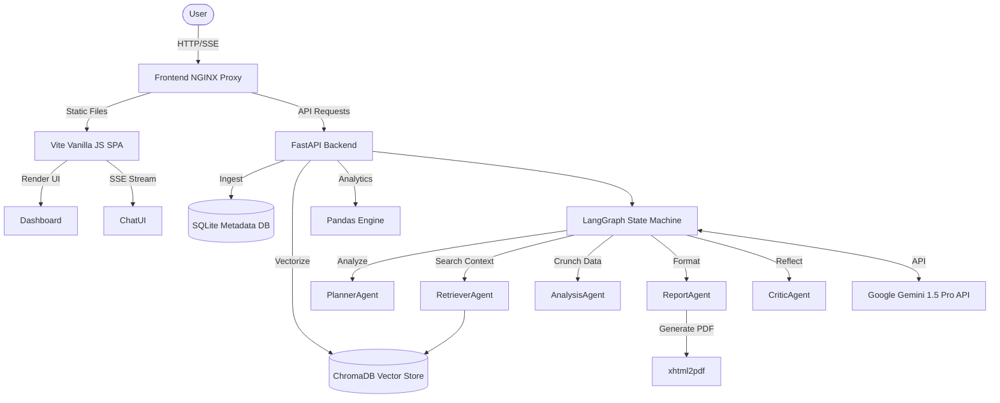

<div align="center">

# 🚀 InsightForge AI

### Enterprise Multi-Agent RAG Architecture

**A production-ready Business Intelligence platform that lets you upload your data and *talk* to it —
powered by a Multi-Agent system, Gemini 1.5 Pro, and ChromaDB.**

[](https://www.python.org/)
[](https://fastapi.tiangolo.com/)
[](https://www.langchain.com/langgraph)
[](https://ai.google.dev/)
[](https://www.docker.com/)
[](LICENSE)

[**🌐 Live Demo**](#-live-demo) • [**📖 API Docs**](#-api-documentation) • [**🏗 Architecture**](#-architecture) • [**🚀 Quick Start**](#-installation--local-development)

</div>

---

## ✨ Overview

**InsightForge AI** is a highly-scalable, enterprise-grade RAG (Retrieval-Augmented Generation) platform built with **Python, FastAPI, LangGraph, and Vanilla JS**. Upload your own datasets — CSV, TXT, or PDF — and chat with them in real time through a coordinated team of AI agents, each specialized in a distinct part of the reasoning pipeline.

It's wrapped in a premium **glassmorphism UI**, backed by vector search, and ships with everything needed to go from `git clone` to a live cloud deployment in minutes.

## 🌐 Live Demo

> 🔗 **[Add your live demo link here]** — e.g. `https://insightforge-ai.onrender.com`
>
> Once deployed via the included Render Blueprint (see [Deployment Guide](#️-deployment-guide-rendercom)), replace this placeholder with your public URL so visitors can try it instantly.

## 🌟 Key Features

| | |
|---|---|
| 🤖 **Multi-Agent Reasoning** | Planner, Retriever, Analysis, Report, and Critic agents collaborate via a LangGraph state machine |
| 📄 **Document Ingestion** | Upload and vectorize CSV, TXT, and PDF files in the background |
| 🔍 **Vector Search** | Fast, relevant context retrieval powered by ChromaDB |
| 💬 **Real-Time Chat** | Server-Sent Events (SSE) streaming for responsive, live AI conversations |
| 📊 **Executive Reports** | One-click PDF report generation synthesized from your data |
| 🎨 **Premium UI** | Lightweight, fast glassmorphism interface built with Vanilla JS + Vite |
| 🐳 **Docker-Native** | Fully containerized backend + frontend, ready for local or cloud deployment |
| ☁️ **1-Click Cloud Deploy** | Built-in `render.yaml` Blueprint for instant Render.com deployment |

## 🏗 Architecture

InsightForge AI follows a robust **microservice-oriented architecture**, cleanly separating a FastAPI backend from an ultra-lightweight Vanilla JS frontend.



### 🧠 The Agent Pipeline

1. **Planner Agent** — breaks down the user's query into an actionable plan
2. **Retriever Agent** — searches ChromaDB for the most relevant document context
3. **Analysis Agent** — crunches numbers and extracts insights via Pandas
4. **Report Agent** — formats findings, optionally generating a PDF report
5. **Critic Agent** — reflects on the output for accuracy and quality before responding

## 📂 Folder Structure

```
enterprise-rag-platform/
├── backend/
│   ├── app/
│   │   ├── agents/      # LangGraph Multi-Agent orchestration
│   │   ├── api/         # FastAPI REST endpoints
│   │   ├── core/        # Configuration, Exceptions, Logging
│   │   ├── db/          # SQLite models and ChromaDB setup
│   │   └── services/    # Business logic (Analytics, Chat, Reports, Document processing)
│   ├── tests/           # Pytest API integration tests
│   ├── Dockerfile
│   └── requirements.txt
├── frontend/
│   ├── src/
│   │   ├── components/  # Reusable UI elements (Skeleton, Buttons)
│   │   ├── layouts/     # Dashboard container layout
│   │   ├── pages/       # SPA Views (Chat, Analytics, Reports, Documents)
│   │   └── services/    # Axios API client
│   ├── tests/           # Vitest unit tests
│   ├── Dockerfile
│   └── nginx.conf
├── docker-compose.yml
├── render.yaml
└── .env.example
```

## 📖 API Documentation

The backend auto-generates interactive Swagger docs. Once running, navigate to:

```
http://localhost:8000/docs
```

### Key Endpoints

| Method | Endpoint | Description |
|---|---|---|
| `POST` | `/api/v1/documents/upload` | Ingests and vectorizes CSV/TXT/PDF files in the background |
| `GET` | `/api/v1/system/status` | Returns comprehensive system metrics |
| `POST` | `/api/v1/chat/{session_id}/stream` | Opens an SSE stream for real-time AI inference |
| `POST` | `/api/v1/reports/generate/{document_id}` | Synthesizes a Business Executive PDF report |

## 🚀 Installation & Local Development

### 1. Clone the repository

```bash
git clone https://github.com/Kajal805-M/InsightForgeAI-Enterprise-Multi-Agent-RAG-Architecture.git
cd InsightForgeAI-Enterprise-Multi-Agent-RAG-Architecture
```

### 2. Configure environment

Copy the example config and add your Gemini API key.

```bash
cp .env.example .env
# Edit .env and insert GEMINI_API_KEY
```

### 3. Run with Docker Compose (recommended)

```bash
docker compose up --build
```

The platform will be available at **`http://localhost`** 🎉

## ☁️ Deployment Guide (Render.com)

This repository ships with a `render.yaml` Blueprint for 1-click cloud deployment.

1. Push the repo to GitHub.
2. Log into [Render](https://render.com) and create a **New Blueprint Instance**.
3. Select your repository — Render automatically provisions two web services (FastAPI backend + NGINX frontend).
4. Add your `GEMINI_API_KEY` in the Render Environment Variables dashboard.
5. Deploy, then update the [Live Demo](#-live-demo) link above with your public URL 🚀

## 🔮 Future Roadmap

- [ ] User authentication (OAuth2 / JWT)
- [ ] PostgreSQL support as a highly-concurrent alternative to SQLite
- [ ] Real-time WebSockets for multi-user collaborative chat
- [ ] Additional agent nodes (e.g., Code Execution Agent, Web Search Agent)

## 🛠 Tech Stack

<div align="left">


</div>

## 🤝 Contributing

Contributions are welcome! Please see [`CONTRIBUTING.md`](CONTRIBUTING.md) for code formatting standards and PR submission guidelines.

## 📄 License

This project is licensed under the **MIT License** — see the [`LICENSE`](LICENSE) file for details.

---

<div align="center">

Made with ❤️ by [Kajal805-M](https://github.com/Kajal805-M)

</div>
